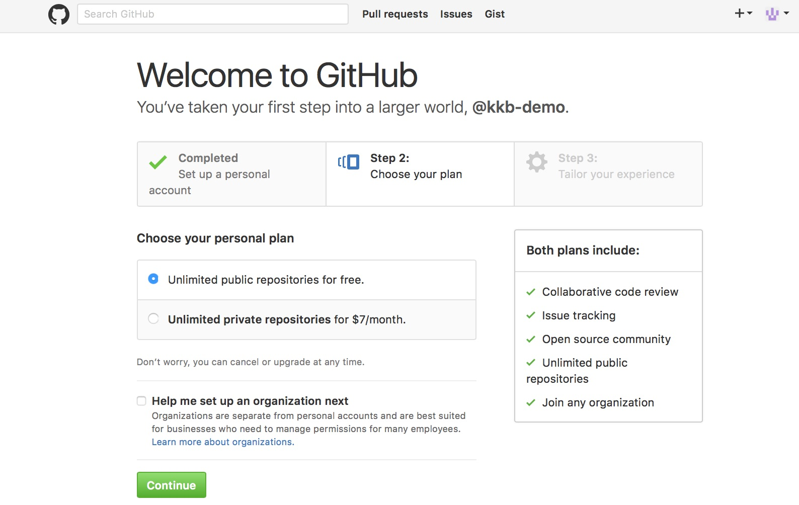
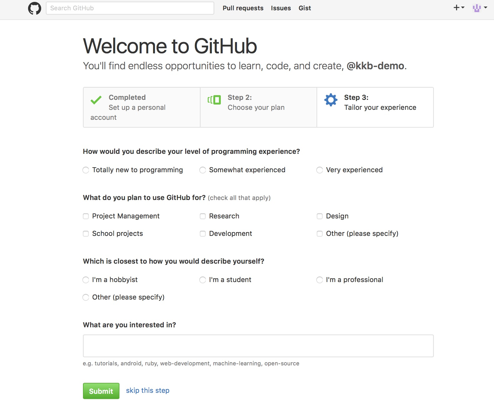
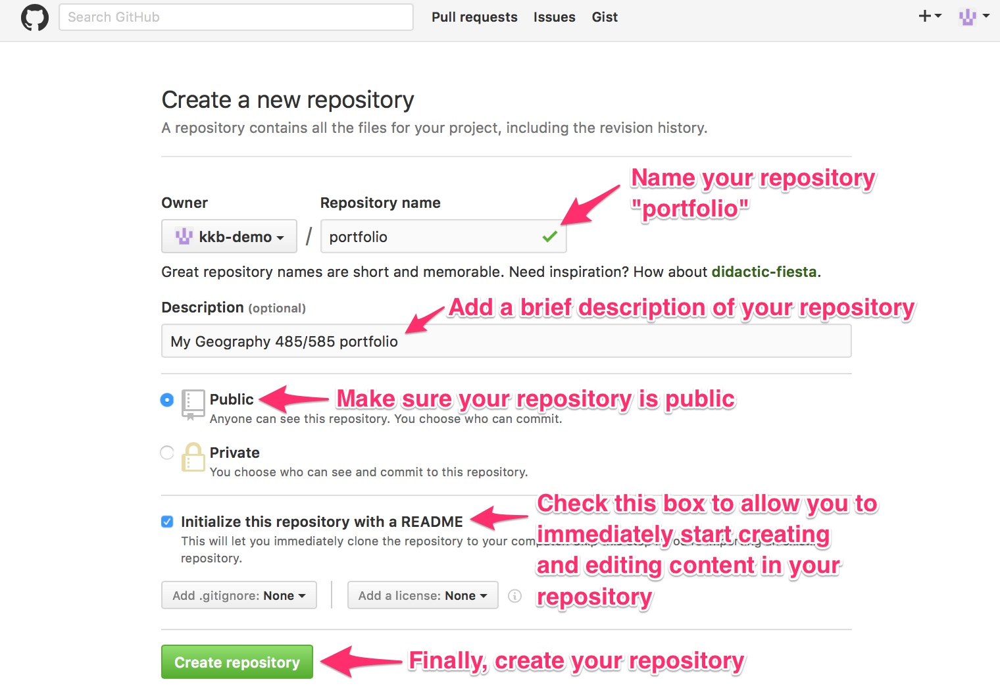
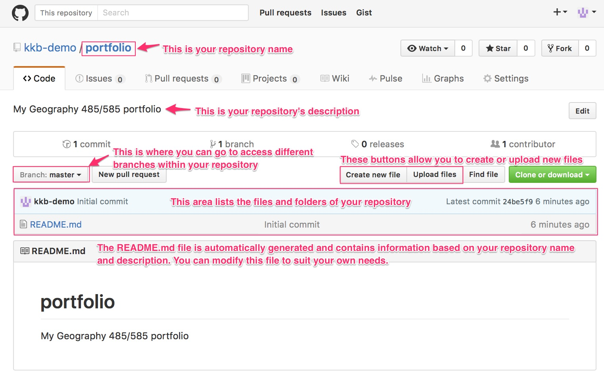
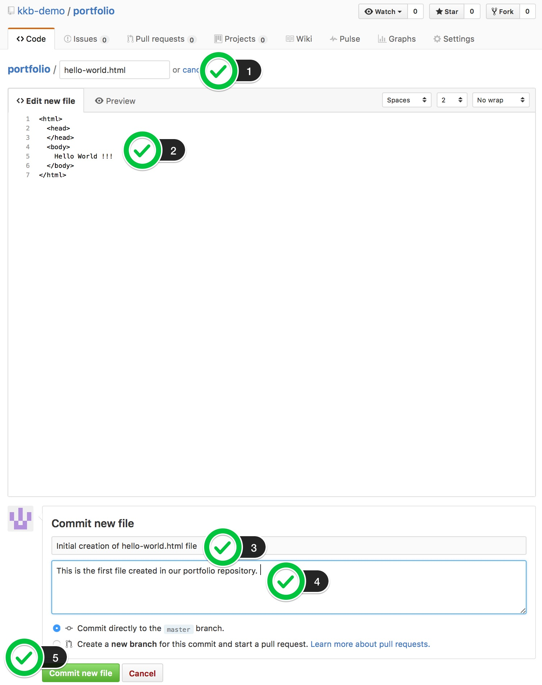
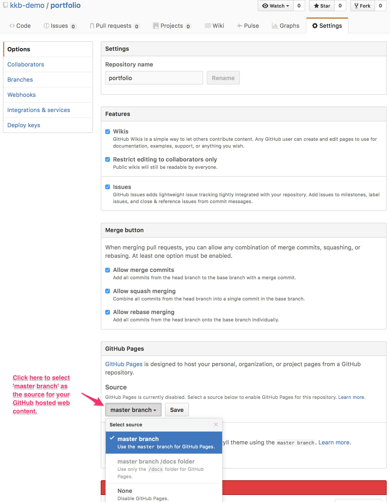

<!---------------------------------------------------------------------------->
<!-- Week 01 ----------------------------------------------------------------->
<!---------------------------------------------------------------------------->

# Week 1 - Introductions, Course Outline & Web Concepts # {#week01}

This week we will review the content and structure for the course and spend some time getting to know each other. Following this we will spend some time setting up some of the tools that you will be using for the course in developing your portfolio of materials. 

## Class Prep ## {#week01-prep}

* [Wikipedia article - History of the World Wide web](http://en.wikipedia.org/wiki/History_of_the_World_Wide_Web)

* [Lynda.com tutorials](http://www.lynda.com/SharedPlaylist/2b710369c9ec4d8c964467225c6610ad?org=unm.edu)

	* *Web Design Fundamentals*
		* Introduction
		* 1. Exploring Web Design
	* *Version Control for Everyone*
		* Introduction
		* 1. Introducing Version Control
		* 2. Version Control Basics
		* 3. Setting Up Your First Project 

## Reference Materials ## {#week01-reference}

[Class Syllabus](https://github.com/UNM-GEOG-485-585/class-materials/raw/master/syllabus.pdf)

## Weekly Milestone - Creating Your GitHub Repository and First Web Page## {#week01-milestone}

Developing content to go onto the web has evolved from a solitary effort to one where teams work together in developing components of larger web sites. These teams need to have a variety of tools to enable their work. Some of the most important tools enable code sharing with the team, and in projects based on the [Open Source](http://opensource.org/osd-annotated) software model the rest of the world. The [GitHub](https://github.com/) web platform uses the [Git](http://git-scm.com/) distributed [version control](http://en.wikipedia.org/wiki/Revision_control) system to enable sharing of code and hosting static web pages based on that shared code. 

You will be using a public [GitHub](http://github.com) repository and associated [*Project Pages*](https://help.github.com/articles/user-organization-and-project-pages/) collection to build your class portfolio during the course. You will learn how version control operates, and how to provide comments and keep notes on your work and comment on the work of others (this will be part of our peer review process).

While the work we do this and next week will be directly through the editor integrated into the GitHub system, you will need to install a desktop application (such as the [SourceTree](https://www.sourcetreeapp.com/) application \[recommended for the class\], the [GitHub Desktop application](https://desktop.github.com), or, for the more adventurous, one of the Git [command line tools](https://git-scm.com/downloads)) that allows you to develop your web pages on your local computer and then update the files on the GitHub system when you want to share a new version. 

For this milestone we will walk through the process of creating your repository in GitHub, creating your first web page, previewing that page on your local computer, changing the page, and updating the page on GitHub. For this milestone we will do this as a manual process which we will streamline in the coming weeks. 

### Create Your GitHub Account and Portfolio Repository

For your work in this class you will build your portfolio within your account - which you will need to create if you don't already have one. 

The first step in the process of creating your portfolio is to create a new (or log into an existing) GitHub account, and create *repository* in GitHub within which you will put your portfolio materials for sharing within the class. Please follow the following steps to create your repository:

1. Go to the [GitHub homepage](https://github.com/) and follow the onscreen instructions for creating a new account. If you already have an account you can skip this step. Once you have created your account you can login and continue the process of creating your class repository. 

{width=70%}

Unless you have specific reasons to do otherwise select the default options for step 2 of the account creation process. 

{width=70%}

(optional) Complete the online survey from GitHub associated with your account. 

{width=70%}
 
2. Check your email inbox and verify your newly created GitHub account. 

3. Select "Start a project" from the web page that is presented when you confirm your email address (or complete the account creation steps above).

{width=70%}

4. Create your portfolio repository by choosing the following options in the page that is presented when you choose "Start a project" in step (3) above. 

{width=70%}

After your successfully create your `portfolio` repository you should see the home page for your new repo:

{width=70%}

**Make note of the web address of this page (even email it to yourself) to make it easy to get back here later** - `https://github.com/<your username>/portfolio`

### Create Your First Web Page

To create your first web page within your portfolio repository you need to first enter your repository, add a new file, modify its contents, and commit your modifications back to the repository to save your changes. 

1. Go to your `portfolio` home page -  `https://github.com/<your username>/portfolio` - either by going directly to the link (above) for your repository or by selecting the repository from your account home page - `https://github.com/<your username>`. 

2. On the page that comes up listing the files in your repository, click the "Create new file" button above the list of files. 

{width=70%}

Which will take you to the editor for your new file. 

3. Enter the name of the file ((1) on the figure below) that you are creating as "hello-world.html" 

4. Enter the following text into the text entry area (2) under the filename field. 

~~~~ {.html .numberLines startFrom="1"}
<html>
	<head>
	</head>		
	<body>
		Hello World !!!
	</body>	
</html>
~~~~~~~~~~~~~~~~~~~~~~~~~~~~~~~~~~~~~~~

5. Add a brief comment (such as "Created hello-world.html from provided text") in the first field under the "Commit new file" title (3). You can optionally add a more detailed description in the next field (4) if you like. 

6. Keep the default option to "Commit directly to the master branch"

7. Click the "Commit New File" button (5) to commit your change and save the file

{width=70%}

*Step 3* - Preview Your Web Page in a Browser

Since your repository in GitHub is public you can use GitHub to host your portfolio and its content on the web. GitHub's hosting capabilities are limited to static content (i.e. files directly accessible over the web), but this will meet our needs for the class very well. To enable GitHub's web hosting capabilities for your repository you need to change the `GitHub Pages` option in the settings for your repository. First, click the `Settings` button near the top of your repository home page:

{width=70%}

Then modify the `GitHub Pages` setting to use the `Master` branch as the source for your GitHub pages web site. Click the `Save` button next to your update. 

{width=70%}

After saving your changed `GitHub Pages` setting you can view your web page using the following pattern: 

`https://<your username>.github.io/<repository name>/<page name>`

which translates into the following (assuming that you followed the instructions above for naming your repository and file:

`https://<your username>.github.io/portfolio/htllo-world.html`

Using this approach you can modify and preview your site in real time as you commit your changes within GitHub. You can also preview your portfolio based on files on your local computer by installing a GitHub client onto your computer and `cloning` your GitHub repository to your local computer. This is done using a desktop application such as [*Sourcetree*](https://www.sourcetreeapp.com), the [*GitHub Desktop Client*](https://desktop.github.com), or another [*Git* client](https://git-scm.com/downloads) appropriate to your operating system. Once you've cloned your repository you can work with the files (including previewing them) on your local computer and when ready `push` those files back into GitHub for online access, viewing and sharing. **While you can work on your files locally - peer review, troubleshooting, and grading will be based on the content in your public GitHub repository**. 

Confirm that the display resembles something like the following:

{width=70%}

6. If the page does not appear as you like, edit it on GitHub, commit your change and preview it again. Repeat until you get what you expect. 

